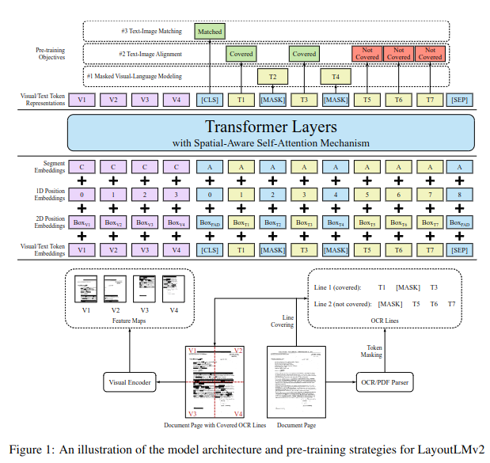
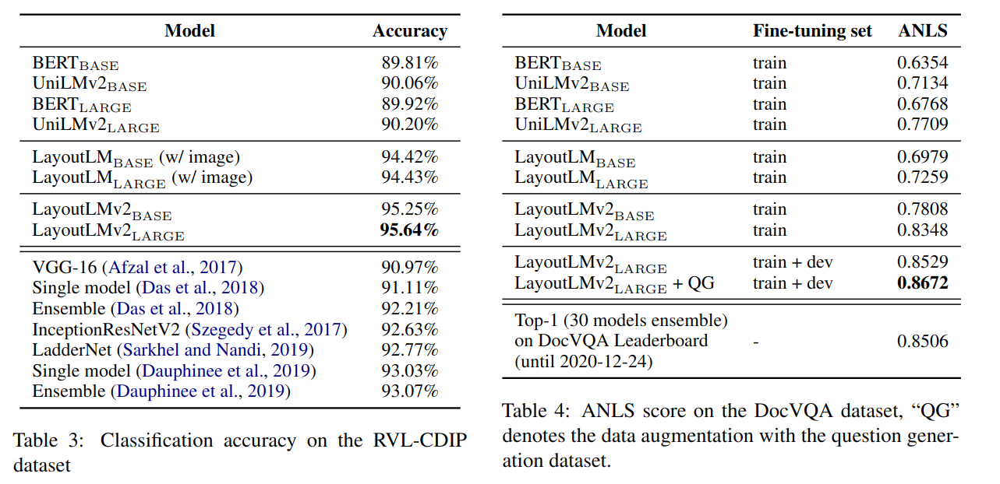
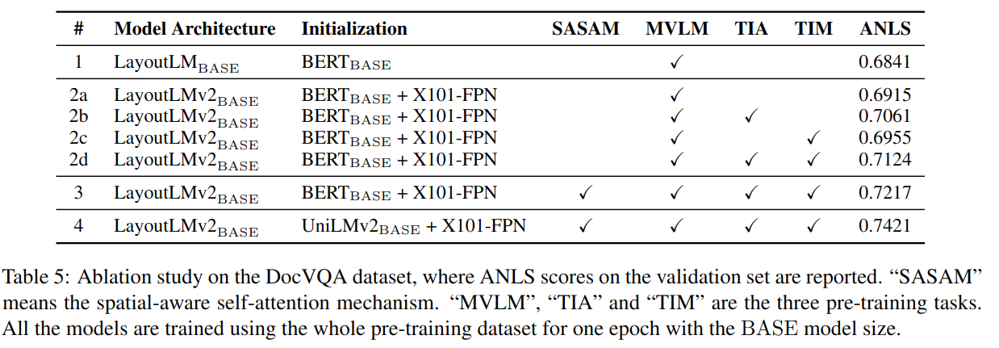

# LayoutLMv2

Paper: [LayoutLMv2: Multi-modal Pre-training for Visually-Rich Document Understanding](https://aclanthology.org/2021.acl-long.201.pdf)

Authors: Yang Xu, Yiheng Xu, Tengchao Lv, Lei Cui, Furu Wei, Guoxin Wang, Yijuan Lu, Dinei Florencio, Cha Zhang, Wanxiang Che, Min Zhang, Lidong Zhou

Public: arXiv:1912.13318, 2020arXiv:2012.14740, 2021

[github](https://github.com/microsoft/unilm/tree/master/layoutlmv2)

## 　Abstract

Pre-training of text and layout has proved effective in a variety of visually-rich document understanding tasks due to its effective model architecture and the advantage of large-scale unlabeled scanned/digital-born documents. We propose LayoutLMv2 architecture with new pre-training tasks to model the interaction among text, layout, and image in a single multi-modal framework. Specifically, with a two-stream multi-modal Transformer encoder, LayoutLMv2 uses not only the existing masked visual-language modeling task but also the new text-image alignment and text-image matching tasks, which make it better capture the cross-modality interaction in the pre-training stage. Meanwhile, it also integrates a spatial-aware self-attention mechanism into the Transformer architecture so that the model can fully understand the relative positional relationship among different text blocks. Experiment results show that LayoutLMv2 outperforms LayoutLM by a large margin and achieves new state-of-the-art results on a wide variety of downstream visually-rich document understanding tasks, including FUNSD (0.7895 to 0.8420), CORD (0.9493 to 0.9601), SROIE (0.9524 to 0.9781), Kleister-NDA (0.8340 to 0.8520), RVL-CDIP (0.9443 to 0.9564), and DocVQA (0.7295 to 0.8672).

## Introduction
The contributions of this paper are summarized as follows: • We propose a multi-modal Transformer model to integrate the document text, layout, and visual information in the pre-training stage, which learns the cross-modal interaction end- to-end in a single framework. 

Meanwhile, a spatial-aware self-attention mechanism is integrated into the Transformer architecture. 

• In addition to the masked visual-language model, we add text-image alignment and text- image matching as the new pre-training strate- gies to enforce the alignment among different modalities. 

• LayoutLMv2 significantly outperforms and achieves new SOTA results not only on the conventional VrDU tasks but also on the VQA task for document images, which demon- strates the great potential for the multi-modal pre-training for VrDU.

## Approach
### Model Architecture

* Text Embedding
    * WordPiece 分詞：LayoutLMv2 使用 WordPiece 方法將 OCR 文本序列進行分詞。WordPiece 方法是一種在自然語言處理中常用的分詞方法。它將文本分割成更小的、更有意義的片段。LayoutLMv2 使用 WordPiece 方法可以更好地捕捉文本中的信息，並提高模型的性能。
    ```
    ti = TokEmb(wi)+PosEmb1D(i)+SegEmb(si)
    ```
    * Segment embedding：LayoutLMv2 為每個文本片段分配一個特定的 segment si ∈ {[A], [B]}。segment embedding 是用於區分不同文本片段的嵌入。它可以幫助模型更好地理解文本的上下文。
    * Token embedding：token embedding 是表示 token 本身的嵌入。它由一個固定大小的向量表示。token embedding 可以捕捉 token 的語義信息和句法信息。
    * Positional embedding：positional embedding 是表示 token 在序列中的位置的嵌入。它由一個可變大小的向量表示。positional embedding 可以幫助模型理解 token 在句子中的位置信息。

    LayoutLMv2 的最終文本嵌入是三個嵌入的和。它可以捕捉 token 的語義、句法和位置信息。這些信息可以幫助模型更好地理解文本，並進行多模態文檔理解。

* Visual Embedding
    * CNN 視覺編碼器：LayoutLMv2 使用 ResNeXt-FPN 架構作為 CNN 視覺編碼器。ResNeXt-FPN 是一個深度卷積神經網路，它可以捕捉圖像中的局部和全局特徵。LayoutLMv2 使用 ResNeXt-FPN 將頁面圖像轉換為固定長度的序列。
    ```
    vi = Proj(VisTokEmb (I))i+PosEmb1D(i)+SegEmb([C])
    ```
    * 視覺嵌入：LayoutLMv2 將 CNN 視覺編碼器的輸出特徵圖平均池化到一個固定大小的圖像。然後，它將圖像攤平成一個視覺嵌入序列。視覺嵌入序列由 W × H 個 token 組成，其中 W 是圖像的寬度，H 是圖像的高度。
    * Positional embedding：LayoutLMv2 為每個視覺 token 添加一個 1D 位置嵌入。1D 位置嵌入可以幫助模型理解視覺 token 在圖像中的位置信息。
    * Segment embedding：LayoutLMv2 將所有視覺 token 都附加到視覺片段 [C]。視覺片段 [C] 用於區分視覺 token 和文本 token。
    
    LayoutLMv2 的最終視覺嵌入是三個嵌入的和。它可以捕捉圖像的局部和全局特徵，以及視覺 token 在圖像中的位置信息。這些信息可以幫助模型更好地理解視覺信息，並進行多模態文檔理解。

* Layout Embedding
    * 布局嵌入層：布局嵌入層是用於將由 OCR 結果表示的軸對齊 token 邊界框表示的空間布局信息嵌入。邊界框包括寬度、高度和角坐標。LayoutLMv2 使用兩個嵌入層分別對 x 軸特徵和 y 軸特徵進行嵌入。
    
    * Normalized and discretized coordinates：LayoutLMv2 將所有坐標標準化並離散化到 [0, 1000] 的範圍內。這可以簡化模型的計算，並提高模型的性能。
    * Concatenated bounding box features：LayoutLMv2 將六個邊界框特徵連接起來構建一個 token 級 2D 位置嵌入，也稱為布局嵌入。
    * Visual token embeddings：LayoutLMv2 將視覺 token 嵌入映射回圖像區域，並且不會重疊或遺漏。當計算邊界框時，視覺 token 可以被視為均勻分割的網格。
    * Empty bounding box：LayoutLMv2 將空邊界框 (0, 0, 0, 0, 0, 0) 附加到特殊 token [CLS]、[SEP] 和 [PAD]。

    布局嵌入層可以捕捉文本 token 和視覺 token 的空間布局信息。這些信息可以幫助模型更好地理解文檔的布局，並進行多模態文檔理解。

* Multi-modal Encoder with Spatial-Aware Self-Attention Mechanism
    * 多模態編碼器：多模態編碼器是 LayoutLMv2 模型的核心部分。它將文本嵌入、視覺嵌入和布局嵌入連接在一起，並使用自注意力機制來捕捉文本、視覺和布局信息之間的關係。
    * 空間感知自注意力機制：空間感知自注意力機制是 LayoutLMv2 模型的一個新穎的貢獻。它可以捕捉文本 token 和視覺 token 的空間布局信息。這可以幫助模型更好地理解文檔的布局，並進行多模態文檔理解。

     

    原始自注意力機制：原始自注意力機制可以捕捉文本 token 之間的關係。但是，它不能有效地捕捉文本 token 和視覺 token 之間的關係。這是因為原始自注意力機制只考慮了 token 的絕對位置。而文本 token 和視覺 token 的空間布局信息是重要的。

     

    空間感知自注意力機制：空間感知自注意力機制可以捕捉文本 token 和視覺 token 之間的關係。它是原始自注意力機制的擴展。它不僅考慮了 token 的絕對位置，還考慮了 token 的空間布局信息。

     
    
    空間感知自注意力機制的工作原理：空間感知自注意力機制首先計算原始自注意力機制的注意力分數。然後，它將注意力分數加上空間信息。空間信息由三個部分組成：

        * 1D 相對位置信息：1D 相對位置信息表示 token 在序列中的位置。
        * 2Dx 相對位置信息：2Dx 相對位置信息表示 token 在 x 軸上的相對位置。
        * 2Dy 相對位置信息：2Dy 相對位置信息表示 token 在 y 軸上的相對位置。

    

    最後，空間感知自注意力機制使用加權平均的方法來計算輸出向量。空間感知自注意力機制可以有效地捕捉文本 token 和視覺 token 之間的關係。這可以幫助模型更好地理解文檔的布局，並進行多模態文檔理解。
###  Pre-training Tasks
* Masked Visual-Language Modeling (MVLM)：MVLM 是 LayoutLMv2 模型使用的一種預訓練任務。它可以幫助模型學習文本和圖像的跨模態關係。在 MVLM 任務中，模型會被隨機遮蔽一些文本 token，並要求模型恢復這些遮蔽的 token。模型可以利用文本 token 的上下文信息和圖像信息來恢復遮蔽的 token。
* Text-Image Alignment (TIA)：TIA 是 LayoutLMv2 模型使用的另一種預訓練任務。它可以幫助模型學習文本和圖像中空間位置的對應關係。在 TIA 任務中，模型會被隨機選擇一些文本行，並在圖像中遮蔽這些文本行對應的圖像區域。模型可以利用文本 token 的上下文信息來判斷是否有圖像區域被遮蔽。
* Text-Image Matching (TIM)：TIM 是 LayoutLMv2 模型使用的最後一種預訓練任務。它可以幫助模型學習文本和圖像的粗粒度對應關係。在 TIM 任務中，模型會被輸入一個文本序列和一張圖像。模型需要判斷這張圖像是否來自於這個文本序列。

### Result
 

###   CONCLUSION 
* LayoutLMv2 is a multi-modal pre-training approach for visually-rich document understanding tasks.
* LayoutLMv2 model not only considers text and layout information, but also integrates image information in the pre-training stage with a single multi-modal framework.
* LayoutLMv2 model uses spatial-aware self-attention mechanism to capture the relative relationship among different bounding boxes.
* LayoutLMv2 model uses new pre-training objectives to enforce the learning of cross-modal interaction among different modalities.
* LayoutLMv2 model has substantially outperformed the SOTA baselines in the document intelligence area on 6 different VrDU tasks, which greatly benefits a number of real-world document understanding tasks.
* For future research, we will further explore the network architecture as well as the pre-training strategies for the LayoutLM family. Meanwhile, we will also investigate the language expansion to make the multi-lingual LayoutLMv2 model available for different languages, especially the non-English areas around the world.