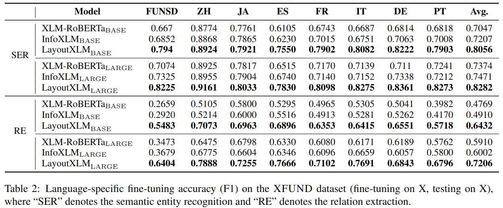
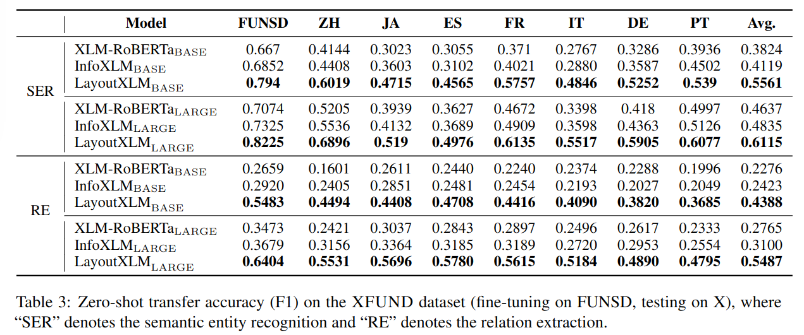
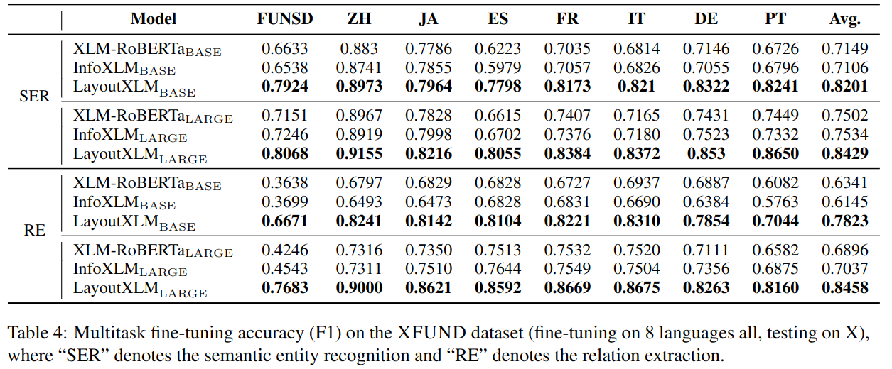

[Yiheng Xu, Tengchao Lv, Lei Cui, Guoxin Wang, Yijuan Lu, Dinei Florencio, Cha Zhang, Furu Wei, "LayoutXLM: Multimodal Pre-training for Multilingual Visually-rich Document Understanding", arXiv:2104.08836, 2021](https://arxiv.org/pdf/2104.08836.pdf)

[github](https://github.com/microsoft/unilm/tree/master/layoutxlm)

## Abstract
Multimodal pre-training with text, layout, and image has achieved SOTA performance for visually-rich document understanding tasks recently, which demonstrates the great potential for joint learning across different modalities. In this paper, we present LayoutXLM, a multimodal pre-trained model for multilingual document understanding, which aims to bridge the language barriers for visually-rich document understanding. To accurately evaluate LayoutXLM, we also introduce a multilingual form understanding benchmark dataset named XFUND, which includes form understanding samples in 7 languages (Chinese, Japanese, Spanish, French, Italian, German, Portuguese), and key-value pairs are manually labeled for each language. Experiment results show that the LayoutXLM model has significantly outperformed the existing SOTA cross-lingual pre-trained models on the XFUND dataset. The pre-trained LayoutXLM model and the XFUND dataset are publicly available at this https URL.

## Introduction

* Multimodal pre-training for visually-rich Document Understanding (VrDU) has achieved new SOTA performance on several public benchmarks recently

* Meanwhile, we are well aware of the demand from the non-English world since nearly 40% of digital documents on the web are in non-English languages.

* Although a large amount of multilingual text data has been used in these cross-lingual pre-trained models, text-only multilingual models cannot be easily used in the VrDU tasks because they are usually fragile in analyzing the documents due to the format/layout diversity of documents in different countries, and even different regions in the same country. 

* We propose LayoutXLM, a multimodal pretrained model for multilingual document understanding, which is trained with large-scale real-world scanned/digital-born documents.
* We also introduce XFUND, a multilingual form understanding benchmark dataset that includes human-labeled forms with key-value pairs in 7 languages (Chinese, Japanese, Spanish, French, Italian, German, Portuguese).
* LayoutXLM has outperformed other SOTA multilingual baseline models on the XFUND dataset, which demonstrates the great potential for the multimodal pre-training for the multilingual VrDU task. The pre-trained LayoutXLM model and the XFUND dataset are publicly available at https://aka.ms/layoutxlm.

## Approach
### Model Architecture

* Similar to the LayoutLMv2 framework, we built
the LayoutXLM model with a multimodal Trans-
former architecture

### Pre-training

* In the MMVLM objective, the model is trained to predict a masked text token based on its remaining text context and the whole layout clues. The layout clues are the bounding boxes of the text tokens.
* To obtain the layout clues for multilingual documents, LayoutXLM uses character-level bounding boxes. This is because the definition of the linguistic unit is different from language to language. For example, in English, a word is the basic unit, but in Chinese, a character is the basic unit.
* The MMVLM objective is trained on a dataset of visually-rich documents. The dataset includes documents in 7 languages: Chinese, Japanese, Spanish, French, Italian, German, and Portuguese.
* The Text-Image Alignment (TIA) task is another pre-training task for LayoutXLM. This task is designed to help the model capture the fine-grained alignment relationship between text and image.

* The MMVLM objective is designed to help LayoutXLM learn to predict missing text tokens in a document, given the remaining text context and the layout clues. This is a challenging task, as the layout clues can be noisy and incomplete.
* The TIA task is designed to help LayoutXLM learn to align text and image regions in a document. This is important for tasks such as table detection and question answering.
* The TIM task is designed to help LayoutXLM learn to understand the semantic relationship between text and image in a document. This is important for tasks such as summarization and translation.

## Experiments
### Pre-training LayoutXLM
Pre-training LayoutXLM Following the original LayoutLMv2 recipe, we train LayoutXLM models with two model sizes. For theLayoutXLM_BASE model, we use a 12-layer Trans-former encoder with 12 heads and set the hidden size to d = 768. For the LayoutXLM_LARGE model,we increase the layer number to 24 with 16 head sand hidden size to d = 1, 024. ResNeXt101-FPNis used as a visual backbone in both models. Finally, the number of parameters in these two mod-els are approximately 345M and 625M. During the pre-training stage, we first initialize the Trans-former encoder along with text embeddings fromInfoXLM and initialize the visual embedding layer with a Mask-RCNN model trained on PubLayNet.
The rest of the parameters are initialized randomly.Our models are trained with 64 Nvidia V100 GPUs
### Fine-tuning on XFUND
We conduct experi-ments on the XFUND benchmark. Besides the ex-periments of typical language-specific fine-tuning,we also design two additional settings to demon-strate the ability to transfer knowledge among dif-ferent languages, which are zero-shot transfer learn-ing and multitask fine-tuning.

## Results

 
 

## Conclusion
In this paper, we present LayoutXLM, a multi- modal pre-trained model for multilingual visually- rich document understanding. 

The LayoutXLM model is pre-trained with 30 million scanned and digital-born documents in 53 languages. 

Mean- while, we also introduce the multilingual form un- derstanding benchmark XFUND, which includes key-value labeled forms in 7 languages. 

Experi- mental results have illustrated that the pre-trained LayoutXLM model has significantly outperformed the SOTA baselines for multilingual document un- derstanding, which bridges the language gap in real- world document understanding tasks. 

We make LayoutXLM and XFUND publicly available to advance the document understanding research. 

For future research, we will further enlarge the multilingual training data to cover more languages as well as more document layouts and templates. 

In addition, as there are a great number of business documents with the same content but in different languages, we will also investigate how to leverage the contrastive learning of parallel documents for the multilingual pre-training.